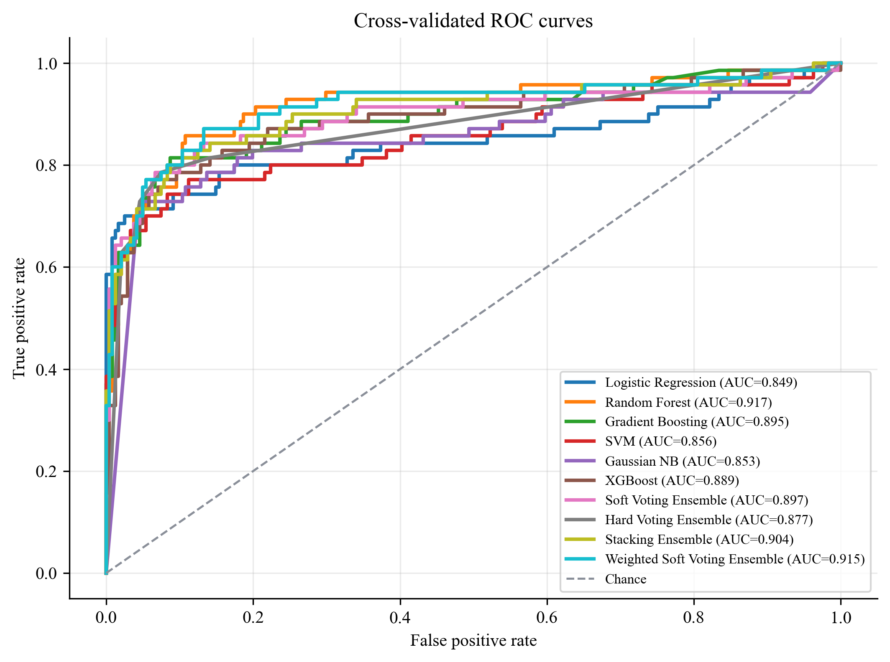
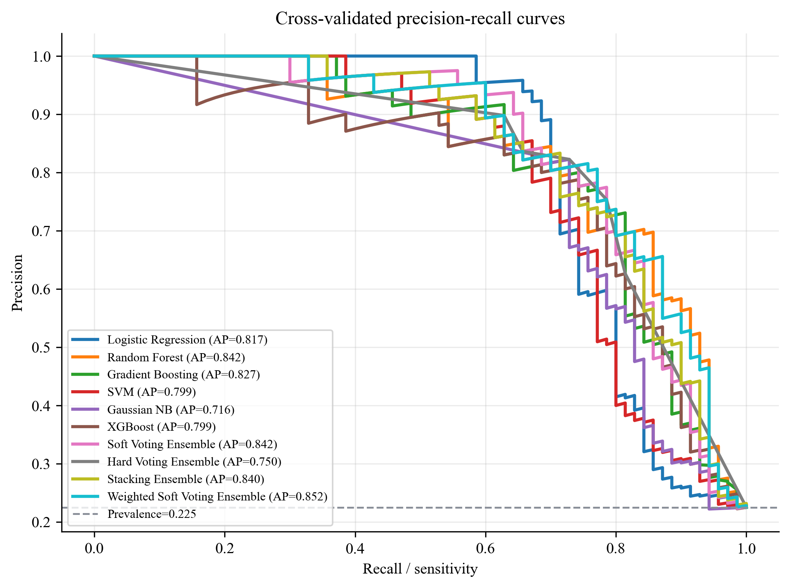
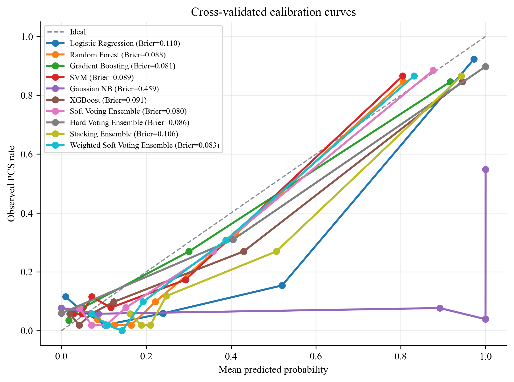
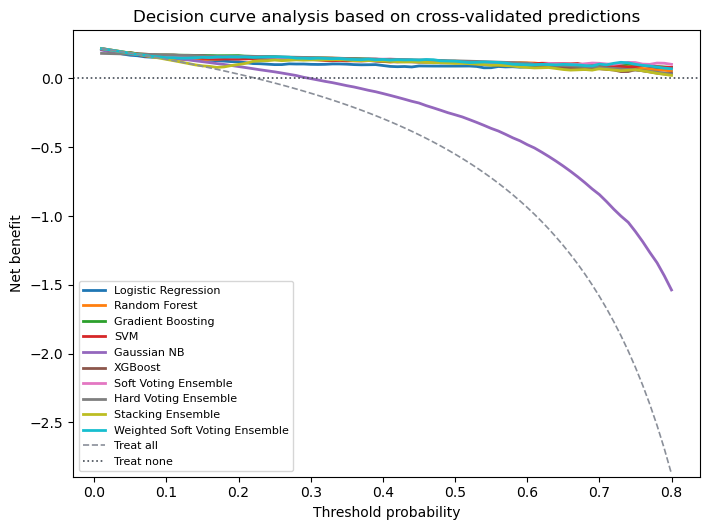
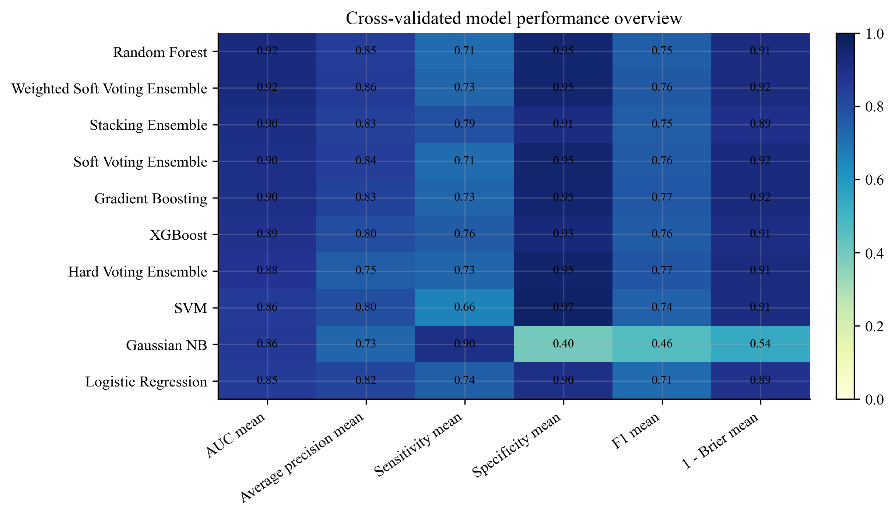

# PCS Machine Learning Model Report

## Dataset and validation

- Dataset: `dataset.csv`
- Sample size: 311; PCS positive: 70; PCS negative: 241; prevalence: 22.5%
- Predictors: 36 preoperative/perioperative clinical variables
- Validation: 5-fold stratified cross-validation, random state = 42
- Preprocessing: median imputation and standardization for numeric variables; most-frequent imputation and one-hot encoding for categorical variables
- Probability estimates and curves are based on out-of-fold predictions from cross-validation.

## Performance summary

| Model | AUC | Average precision | Sensitivity | Specificity | F1 | Brier score | OOF AUC | OOF Brier | OOF confusion matrix |
| --- | --- | --- | --- | --- | --- | --- | --- | --- | --- |
| Random Forest | 0.922 ± 0.041 ↑ | 0.845 ± 0.060 ↑ | 0.714 ± 0.134 ↑ | 0.946 ± 0.011 ↑ | 0.747 ± 0.078 ↑ | 0.088 ± 0.010 ↓ | 0.917 | 0.088 | TN=228, FP=13, FN=20, TP=50 |
| Weighted Soft Voting Ensemble | 0.919 ± 0.047 ↑ | 0.855 ± 0.062 ↑ | 0.729 ± 0.117 ↑ | 0.950 ± 0.011 ↑ | 0.763 ± 0.066 ↑ | 0.083 ± 0.011 ↓ | 0.915 | 0.083 | TN=229, FP=12, FN=19, TP=51 |
| Stacking Ensemble | 0.903 ± 0.044 ↑ | 0.833 ± 0.041 ↑ | 0.786 ± 0.124 ↑ | 0.913 ± 0.036 ↑ | 0.752 ± 0.074 ↑ | 0.106 ± 0.014 ↓ | 0.904 | 0.106 | TN=220, FP=21, FN=15, TP=55 |
| Soft Voting Ensemble | 0.898 ± 0.056 ↑ | 0.843 ± 0.063 ↑ | 0.714 ± 0.051 ↑ | 0.950 ± 0.023 ↑ | 0.758 ± 0.039 ↑ | 0.080 ± 0.012 ↓ | 0.897 | 0.080 | TN=229, FP=12, FN=20, TP=50 |
| Gradient Boosting | 0.899 ± 0.040 ↑ | 0.830 ± 0.042 ↑ | 0.729 ± 0.078 ↑ | 0.950 ± 0.043 ↑ | 0.768 ± 0.051 ↑ | 0.081 ± 0.020 ↓ | 0.895 | 0.081 | TN=229, FP=12, FN=19, TP=51 |
| XGBoost | 0.889 ± 0.056 ↑ | 0.799 ± 0.080 ↑ | 0.757 ± 0.108 ↑ | 0.930 ± 0.031 ↑ | 0.756 ± 0.066 ↑ | 0.091 ± 0.016 ↓ | 0.889 | 0.091 | TN=224, FP=17, FN=17, TP=53 |
| Hard Voting Ensemble | 0.877 ± 0.054 ↑ | 0.751 ± 0.078 ↑ | 0.729 ± 0.032 ↑ | 0.954 ± 0.017 ↑ | 0.773 ± 0.022 ↑ | 0.086 ± 0.017 ↓ | 0.877 | 0.086 | TN=230, FP=11, FN=19, TP=51 |
| SVM | 0.855 ± 0.060 ↑ | 0.795 ± 0.077 ↑ | 0.657 ± 0.093 ↑ | 0.967 ± 0.028 ↑ | 0.741 ± 0.080 ↑ | 0.089 ± 0.020 ↓ | 0.856 | 0.089 | TN=233, FP=8, FN=24, TP=46 |
| Gaussian NB | 0.857 ± 0.065 ↑ | 0.729 ± 0.045 ↑ | 0.900 ± 0.064 ↑ | 0.398 ± 0.179 ↑ | 0.462 ± 0.080 ↑ | 0.459 ± 0.152 ↓ | 0.853 | 0.459 | TN=96, FP=145, FN=7, TP=63 |
| Logistic Regression | 0.848 ± 0.048 ↑ | 0.818 ± 0.049 ↑ | 0.743 ± 0.064 ↑ | 0.900 ± 0.031 ↑ | 0.713 ± 0.069 ↑ | 0.110 ± 0.015 ↓ | 0.849 | 0.110 | TN=217, FP=24, FN=18, TP=52 |

## Current best model

The top-ranked model by out-of-fold AUC is **Random Forest** with OOF AUC = **0.917**, OOF average precision = **0.842**, and OOF Brier score = **0.088**.

Because PCS prevalence is imbalanced, the report emphasizes sensitivity, precision-recall performance, calibration, and decision curve analysis in addition to AUC.

## Ensemble architecture validation

Four ensemble strategies were evaluated under the same 5-fold out-of-fold validation protocol:

- **Soft Voting Ensemble**: averages predicted probabilities from Logistic Regression, Random Forest, Gradient Boosting, SVM, and XGBoost.
- **Hard Voting Ensemble**: uses the fraction of positive votes as the risk score.
- **Stacking Ensemble**: uses a logistic meta-learner trained from base-model probability outputs within the training folds.
- **Weighted Soft Voting Ensemble**: searches model weights inside each outer training fold using 3-fold inner out-of-fold AUC, then applies the selected weights to the outer validation fold.

| Ensemble | OOF AUC | OOF AP | OOF Brier | Sensitivity | Specificity | F1 |
| --- | --- | --- | --- | --- | --- | --- |
| Weighted Soft Voting Ensemble | 0.915 | 0.852 | 0.083 | 0.729 | 0.950 | 0.763 |
| Stacking Ensemble | 0.904 | 0.840 | 0.106 | 0.786 | 0.913 | 0.752 |
| Soft Voting Ensemble | 0.897 | 0.842 | 0.080 | 0.714 | 0.950 | 0.758 |
| Hard Voting Ensemble | 0.877 | 0.750 | 0.086 | 0.729 | 0.954 | 0.773 |

The best single base model was **Random Forest** with OOF AUC = **0.917** and OOF Brier score = **0.088**. The highest-AUC ensemble was **Weighted Soft Voting Ensemble** with OOF AUC = **0.915** (delta vs. best base model = **-0.002**). The best-calibrated ensemble by Brier score was **Soft Voting Ensemble** with OOF Brier score = **0.080** (delta vs. best base model = **-0.008**).

Interpretation: the optimized weighted soft-voting ensemble approached but did **not** exceed the best Random Forest model in discrimination. It improved average precision and Brier score, suggesting modest benefit for probability quality rather than AUC. Therefore, the ensemble can be presented as an architecture validation experiment rather than the final preferred model.

## Curves

## Output files

- `model_performance.xlsx`: summary and fold-level performance
- `model_performance_summary.csv`: model-level summary
- `model_performance_by_fold.csv`: fold-level metrics
- `cross_validated_oof_predictions.csv`: out-of-fold predicted probabilities
- `modeling_metadata.json`: reproducibility metadata

## Notes for manuscript writing

- These results are internally validated only and should be described as cross-validated performance.
- Final threshold selection should be clinically justified; the current confusion matrices use threshold = 0.5 for comparability.
- External validation is still required before clinical deployment.
