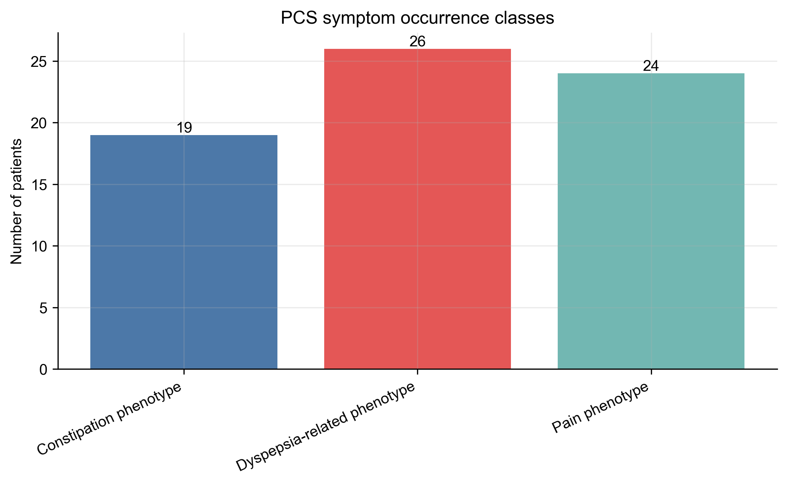
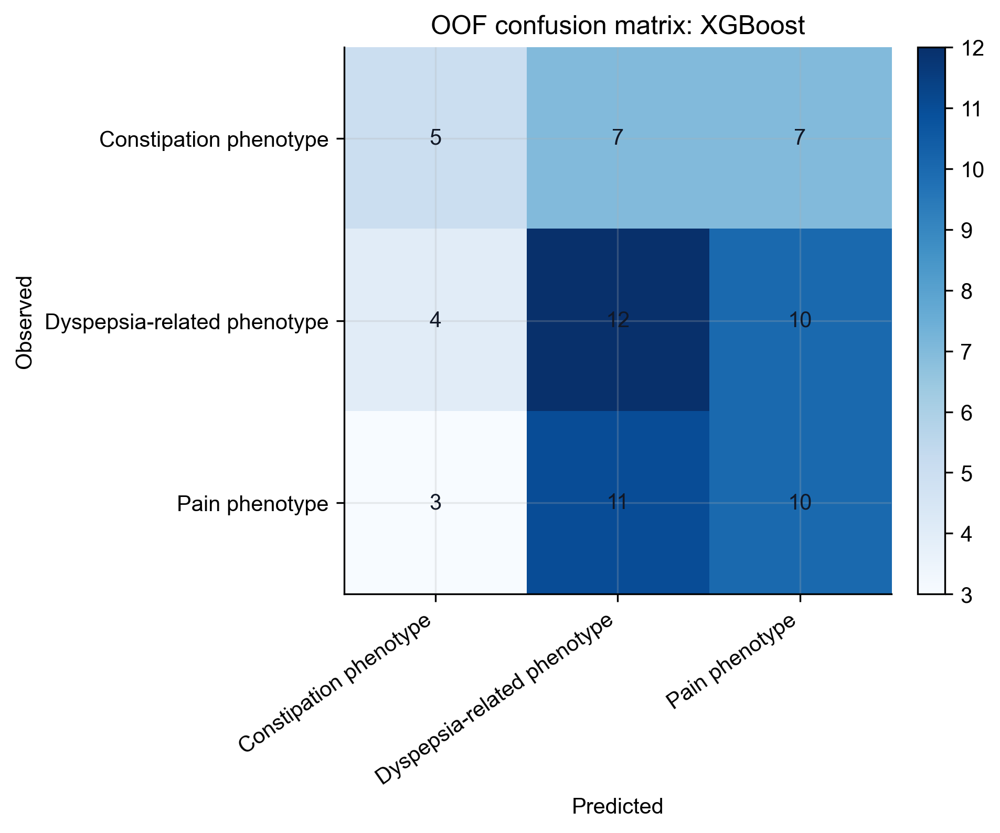
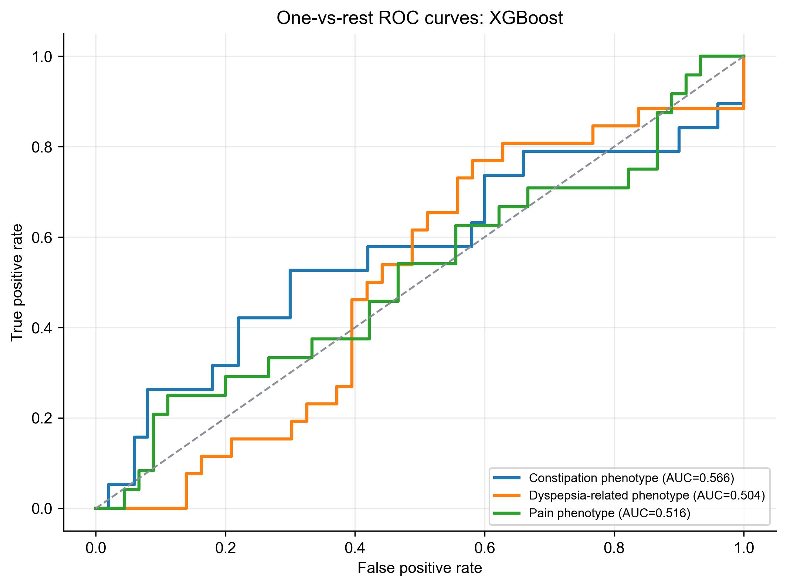

# PCS Symptom Occurrence Prediction Task

## Label construction

The original free-text field `PCS症状类型` was converted into structured labels and a merged modeling category. This task is a downstream subtype classifier among PCS-positive patients and is **not** used as an input feature for the original PCS binary prediction model.

Constructed classes in the full cohort:

| class | display_name | n |
| --- | --- | --- |
| no_pcs | No PCS | 241 |
| gi_dysfunction_dyspepsia | Dyspepsia-related phenotype | 26 |
| pain | Pain phenotype | 24 |
| constipation | Constipation phenotype | 19 |
| pcs_unknown | PCS symptom unknown | 1 |

Modeled downstream symptom-subtype classes:

| class | display_name | n |
| --- | --- | --- |
| gi_dysfunction_dyspepsia | Dyspepsia-related phenotype | 26 |
| pain | Pain phenotype | 24 |
| constipation | Constipation phenotype | 19 |

Raw symptom text distribution:

| raw_symptom | n |
| --- | --- |
| None | 242 |
| 腹痛 | 24 |
| 便秘 | 19 |
| 胃肠功能紊乱 | 12 |
| 消化不良 | 8 |
| 肠道菌群失调 | 3 |
| 慢性胃炎 | 2 |
| 腹胀 | 1 |

## Prediction task

- Task: multiclass prediction of symptom subtype among PCS-positive patients.
- Outcome: `pcs_symptom_category`.
- Included classes for modeling: constipation, gi_dysfunction_dyspepsia, pain.
- Excluded from modeling: `no_pcs`, because this is a downstream subtype task after PCS occurrence; `pcs_unknown`, because only one PCS-positive patient lacked a symptom text label.
- Predictors: the same preoperative/perioperative variables used in the original PCS prediction task.
- Validation: 5-fold stratified cross-validation.
- Balanced accuracy is the mean recall across the modeled PCS symptom subtypes only; it does not include the `no_pcs` class.

## Model performance

| model | oof_accuracy | oof_balanced_accuracy | oof_macro_f1 | oof_weighted_f1 | oof_macro_ovr_auc | oof_log_loss |
| --- | --- | --- | --- | --- | --- | --- |
| XGBoost | 0.391 | 0.380 | 0.381 | 0.387 | 0.529 | 1.336 |
| Multinomial Logistic | 0.391 | 0.382 | 0.381 | 0.390 | 0.565 | 2.071 |
| Random Forest | 0.391 | 0.373 | 0.365 | 0.378 | 0.548 | 1.104 |
| Gradient Boosting | 0.362 | 0.351 | 0.348 | 0.355 | 0.544 | 1.514 |
| SVM | 0.246 | 0.225 | 0.197 | 0.214 | 0.445 | 1.140 |

The current top-ranked model by macro F1 is **XGBoost** with OOF macro F1 = **0.381**, OOF balanced accuracy = **0.380**, and OOF macro one-vs-rest AUC = **0.529**.

## Figures

## Manuscript-ready wording

To further characterize PCS heterogeneity, the free-text PCS symptom field was mapped to structured symptom phenotypes. Among PCS-positive patients with known symptoms, labels were grouped into pain, constipation, and dyspepsia-related phenotypes. Raw entries originally recorded as intestinal dysbiosis or gastrointestinal dysfunction were treated as dyspepsia symptoms for labeling, while the underlying mechanisms can be discussed separately. A downstream multiclass classifier was then constructed using the same preoperative/perioperative predictors. This task should be interpreted as exploratory because symptom subtype sample sizes are small and external validation is unavailable.
