# SHAP Explainability Report for PCS Prediction

## Model used for interpretation

Random Forest was selected for SHAP interpretation because it had the highest out-of-fold AUC in the 5-fold cross-validation report (OOF AUC = 0.917, OOF Brier score = 0.088).

The model was refitted on the full dataset after the same preprocessing pipeline used in cross-validation. SHAP values therefore describe the fitted final Random Forest model; they should be interpreted as internal explanatory evidence, not as external validation.

## Main interpretable findings

- The most influential variables by aggregated mean absolute SHAP value were: GGT, ALT, AST, ALP, CA19-9, Total bilirubin.
- At the domain level, the largest contribution came from **Laboratory**, followed by the remaining clinical domains shown below.
- The individual waterfall plot selected a high-risk PCS-positive patient with predicted PCS probability = **0.974**.

## Variable-level SHAP importance

| display_name | clinical_group | mean_abs_shap | rank |
| --- | --- | --- | --- |
| GGT | Laboratory | 0.0825 | 1 |
| ALT | Laboratory | 0.0761 | 2 |
| AST | Laboratory | 0.0481 | 3 |
| ALP | Laboratory | 0.0420 | 4 |
| CA19-9 | Laboratory | 0.0400 | 5 |
| Total bilirubin | Laboratory | 0.0340 | 6 |
| Symptom duration | Symptoms | 0.0206 | 7 |
| Total bile acid | Laboratory | 0.0195 | 8 |
| Pain frequency | Symptoms | 0.0179 | 9 |
| Age | Demographics | 0.0075 | 10 |

## Domain-level SHAP contribution

| clinical_group | mean_abs_shap |
| --- | --- |
| Laboratory | 0.3573 |
| Symptoms | 0.0425 |
| Demographics | 0.0289 |
| Imaging | 0.0147 |
| Medical history | 0.0030 |
| Lifestyle | 0.0024 |

## Directional interpretation of top transformed features

This table uses Spearman correlation between transformed feature values and SHAP values. It is a direction hint, not a causal estimate.

| feature | direction_hint | spearman_rho_feature_vs_shap | p_value | original_variable_guess |
| --- | --- | --- | --- | --- |
| ggt | higher value increases predicted PCS risk | 0.794 | 7.76e-69 | ggt |
| alt | higher value increases predicted PCS risk | 0.454 | 2.94e-17 | alt |
| ast | higher value increases predicted PCS risk | 0.542 | 3.82e-25 | ast |
| alp | higher value increases predicted PCS risk | 0.801 | 8.04e-71 | alp |
| ca199 | higher value increases predicted PCS risk | 0.802 | 2.82e-71 | ca199 |
| total_bilirubin | higher value increases predicted PCS risk | 0.582 | 1.52e-29 | total_bilirubin |
| total_bile_acid | higher value increases predicted PCS risk | 0.636 | 1.08e-36 | total_bile_acid |
| symptom_duration_very_short | higher value increases predicted PCS risk | 0.851 | 1.41e-88 | symptom_duration_very_short |
| pain_frequency_daily | higher value increases predicted PCS risk | 0.862 | 4.69e-93 | pain_frequency_daily |
| age | higher value increases predicted PCS risk | 0.610 | 3.91e-33 | age |

## Figures

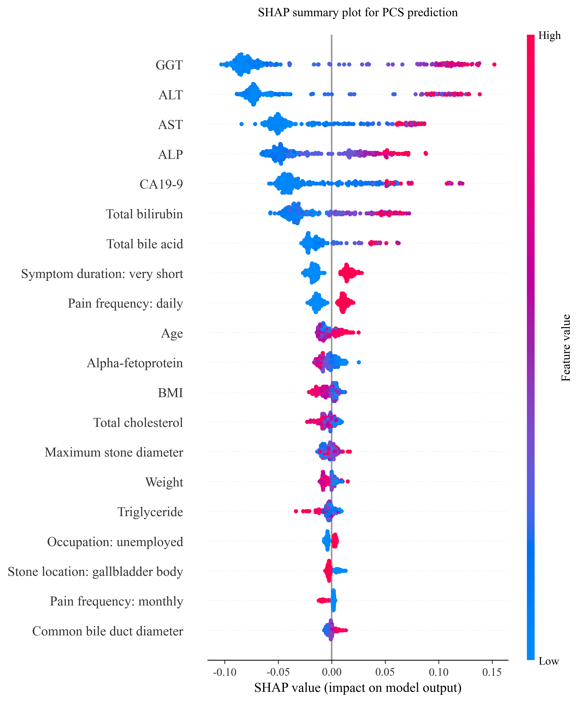

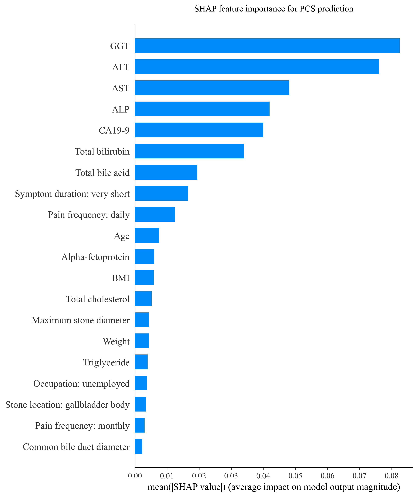

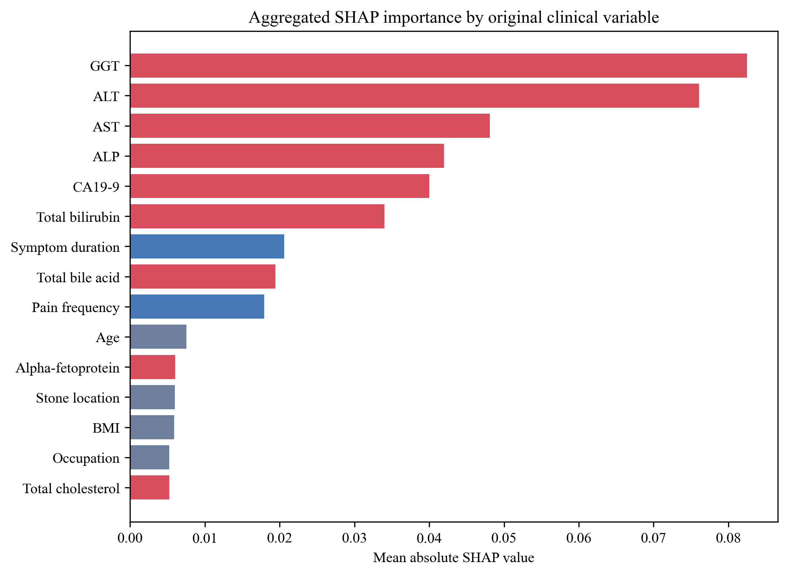

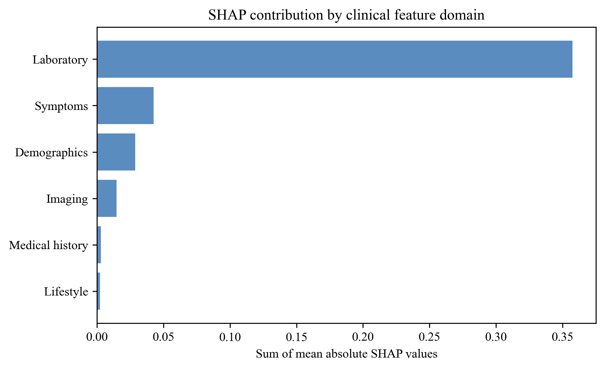

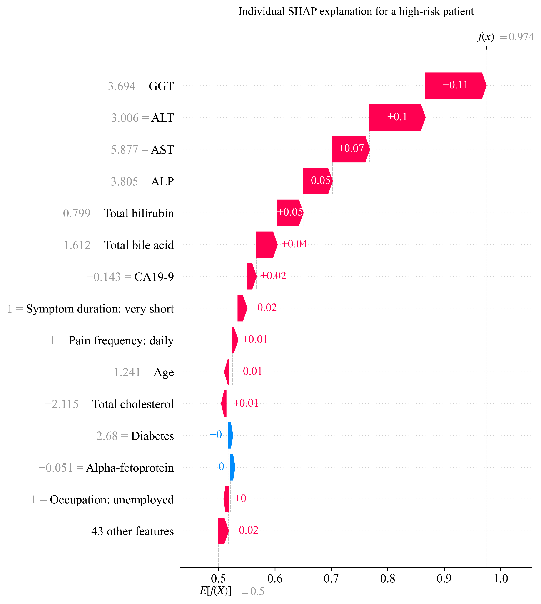

Dependence plots:

- 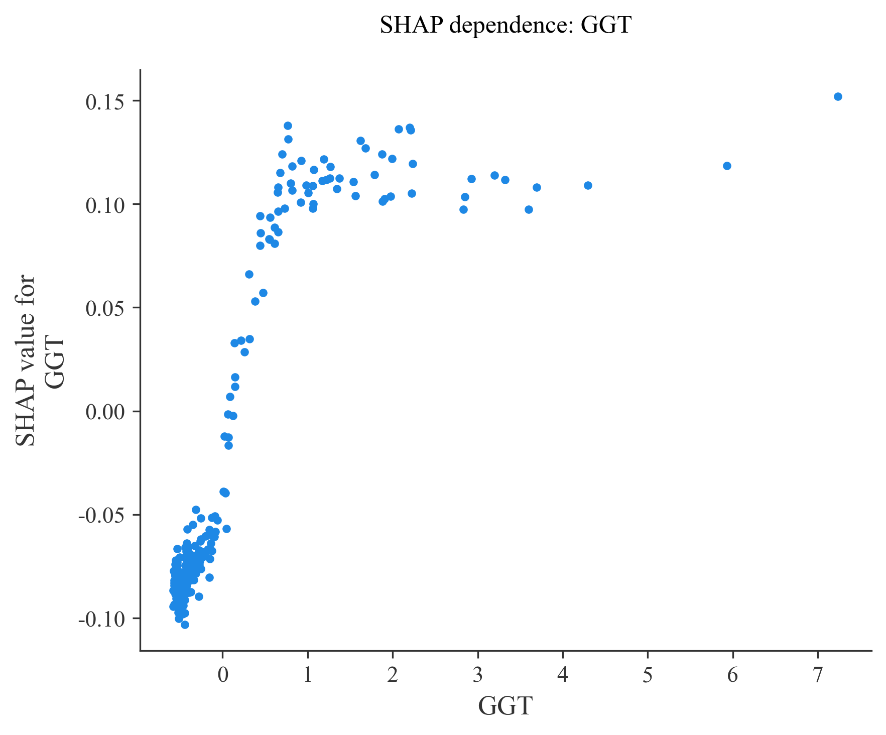
- 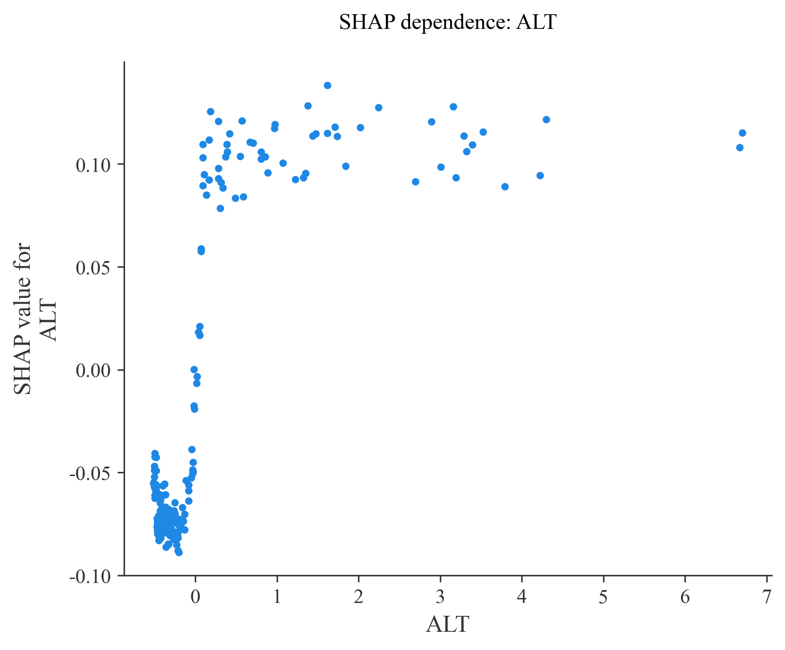
- 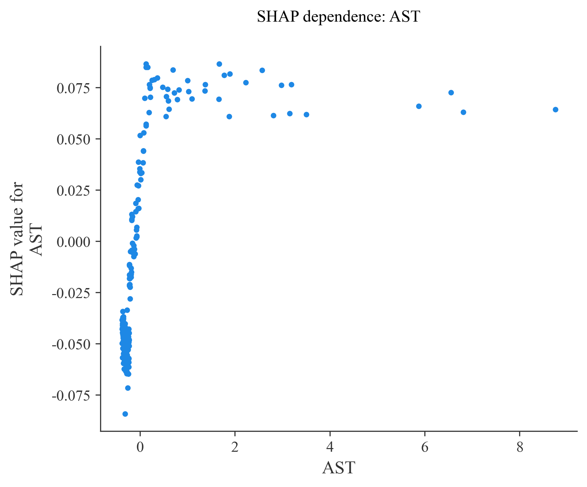
- 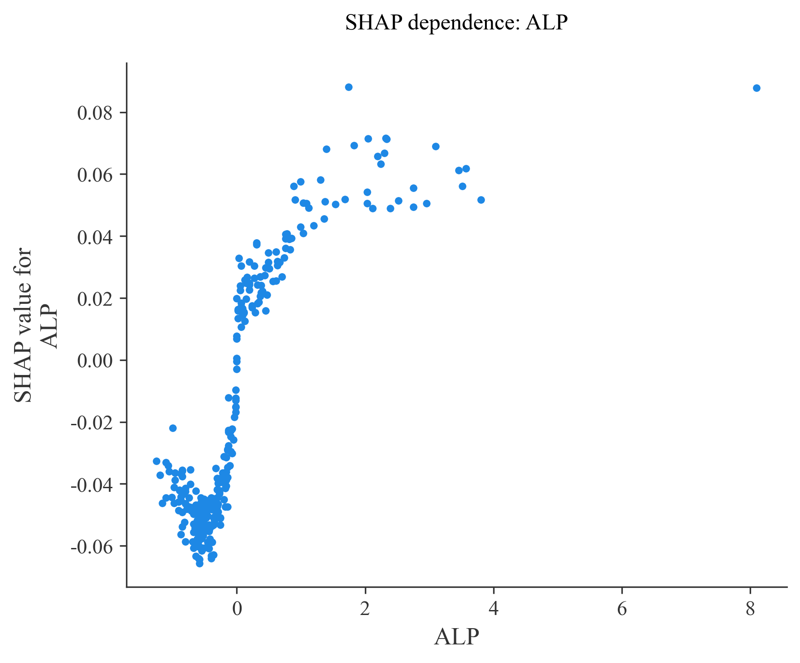
- 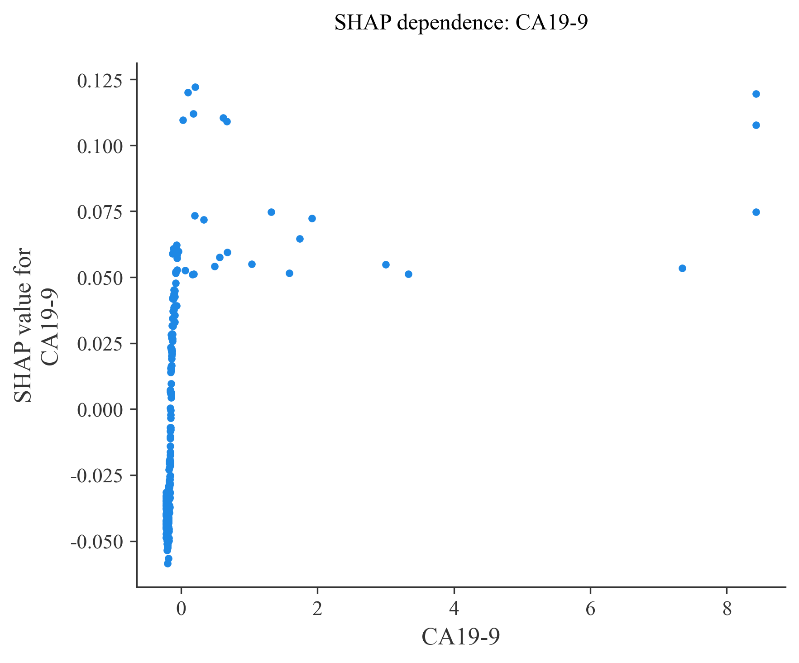
- 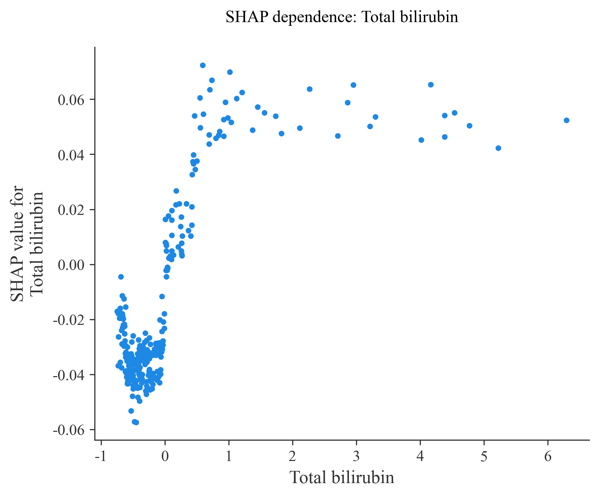

## Manuscript-ready interpretation

The SHAP analysis indicated that the final Random Forest model mainly relied on hepatobiliary laboratory markers and preoperative symptom-related variables when estimating PCS risk. High-impact features included laboratory markers such as GGT, ALT, ALP, AST, bilirubin-related indices and CA19-9, together with symptom duration and pain-frequency-related information where selected by the model. These findings suggest that biochemical evidence of biliary or hepatocellular disturbance and symptom burden may jointly contribute to model-based PCS risk stratification.

Because SHAP explains model behavior rather than biological causality, these findings should be discussed as model-derived risk signals. They support clinical interpretability of the prediction model but still require external validation and prospective assessment.
